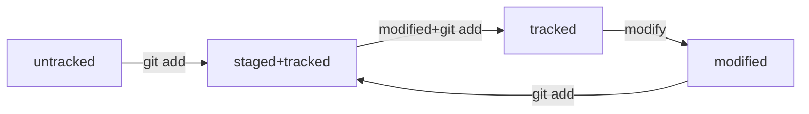

# git_lesson

## start with local GIT


- **Install GIT to your pc <br>**
```shell
sudo apt install git
```
- **Initalise GIT<br>**
```shell
git init
```
- **check GIT configuration<br>**
```shell
git config
```
- **check GIT status <br>**
```shell
git status
```
- #delete GIT from folder <br>
```shell
rm -rf .git
```

---
## generate SSH keys public and private

12

- go to your home directory <br>
cd ~
- #check if you already have a generated ssh key <br>
ls -la .ssh/
- #generate public/private rsa key pair <br>
ssh-keygen -t ed25519 -C your@email.on-github
- #check that key pair has been generated correctely <br>
ls -a ~/.ssh

--------

## create public GIT repo

- #create an account on github.com
- #create new repo
- #insert ssh key. Settings-->SSH and GPG keys --> New SSH key
- #check availability of your SSH key on github <br>
ssh -T git@github.com 

----------

## Connect local GIT and remote repo

- #connect local GIT and remote repo <br>
git remote add origin git@github.com:XandrAsh/git_lesson.git
- #ensure that local git and remote repo are connected
git remote -v

------------

## make changes to remote repo from local git

- #add all changes to commit queue <br>
git add --all
- #commit all changes <br>
git commit -m 'my comment for commit'
- #push all changes to remote repo for the first time <br> 
git push -u origin master
- #compare and pull-request <br>
- #create pull-request <br>
- #merge pull-request <br>
- #confirm merge  <br>

----------

## Other usefull git commands
- #create isolated development environments within a single repository  <br>
git branch 
- #check out old commits and old file revisions, navigate existing branches  <br>
git checkout
- #Remove untracked files from the working directory  <br>
git clean 
- #Create a copy of an existing Git repository  <br>
git clone 
- #Fetch downloads a branch from another repo, along with all of its associated commits and files  <br>
git fetch 
- #explore the previous revisions of a project  <br>
git log
- #integrate changes from divergent branches  <br>
git merge 
- #download a branch from a remote repository and merge it into the current branch  <br>
git pull 
- #clean up or completely remove changes that have not been pushed to a public repository  <br>
git reset 


---------

## hash

- #40 symbols sha-1  <br>
- #stores info about author + date  <br>
- #commit: hash, author, date, comment  <br>
- #see short git log <br>
git log --oneline
- #HEAD file = last commit <br>
cat HEAD
- #see last commit hash  <br>
cat refs/heads/master

----------

## statuses 

- #untracked: Untracked new files (to move to tracked use git add...)  <br>
- #tracked: (after git add or git commit)  <br>
- #staged: Changes to be committed, indexed or cashed,  modified+git add <br>
- #modified: Changes not staged for commit <br>
- #to unstage   <br>
git restore --staged .
- #to discard changes in working directory <br>
git restore ...

--------

## Messages

- #from 30 to 70 symbols <br>
- #informative <br>
- #Jira-ID, Feat/fix,  #of bag, short description <br>

## mermaid


------------

## commit

- #change your last (HEAD) commit without changing comment <br>
git commit --amend --no-edit
- #change your last (HEAD) commit and comment <br>
git commit --amend -m "New message"
- #update your comment in NANO or VIM <br>
- #lauch VIM tutoruail <br>
vimtutor
- #reset last commit <br>
git reset --hard <commit hash>

---------

## track file changes

- #get files differences <br>
git diff
- #red line (and minus) = line was deleted <br>
- #green line (and plus) = line was inserted <br>
- #a/stihi.txt = original version of file <br>
- #b/stihi.txt = new version of file <br>
- #@@ -1,10 +1,10 @@ - 10 lines are shown started from first line <br>

--------- 

## change file

- #add line to the end of the file <br>
cat file.txt <br>
echo "Hello!" >> file.txt <br>
cat file.txt <br>
- #erase info in file <br>
echo "Новая строка" > file.txt
- #compare two commit  <br>
git diff 1c29af6 48fe3dc or git diff 1c29af6 HEAD
- #show all hash commits  <br>
git log --oneline
- #show all staged (indexed) commits  <br>
git diff --staged

-----------

## gitignore

- "#" = line with comment  <br>
- #ignore all files which end with .jpeg  <br>
*.jpeg
- #ignore all files which end with .jpeg in foulders docs  <br>
docs/*/tmp 
- #ignore all files which name starts with file and ends with .txt  <br>
file?.txt 
- #ignore all files which name starts with file and ends with .txt in the middle symbole from [] <br>
file[0-2].txt
- #ignore toso.txt in root foulder <br>
/todo.txt
- #ignore all files in foulder build <br>
build/ 
- #ignore such files as "docs/current/tmp", "docs/old/tmp","docs/old/saved/a/b/c/d/tmp" <br>
docs/**/tmp
- #don't ignore doge.jpeg file
!doge.jpeg 
